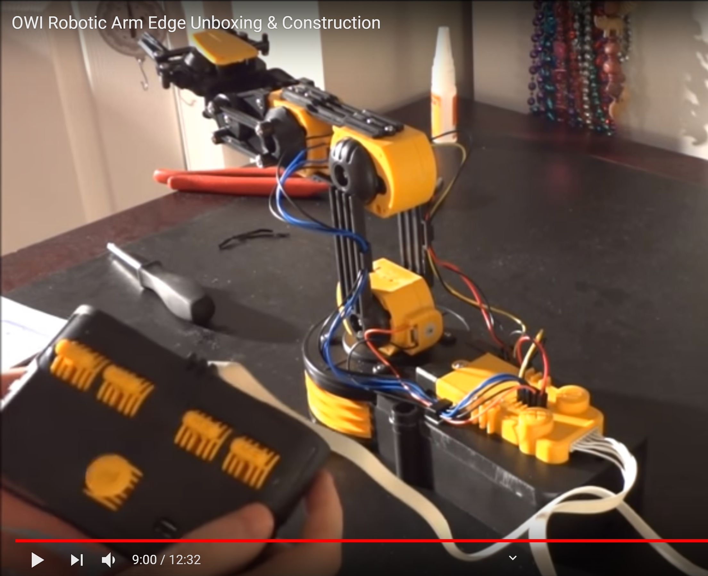
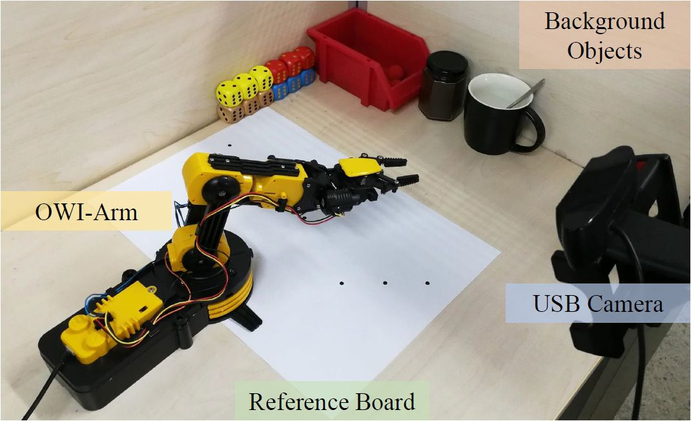
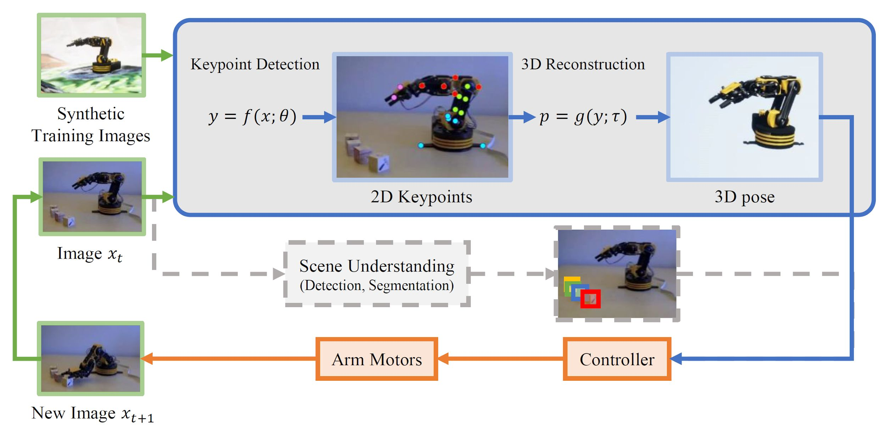
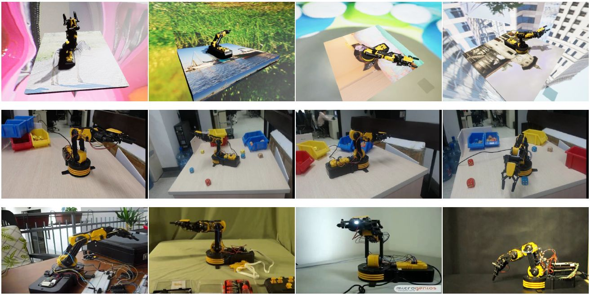

# CRAVES: Controlling Robotic Arm with a Vision-based, Economic System


# Introduction

Training a robotic arm to accomplish real-world tasks has been attracting increasing attention in both academia and industry. This work discusses the role of computer vision algorithms in this field. We focus on low-cost arms on which no sensors are equipped and thus all decisions are made upon visual recognition, e.g., real-time 3D pose estimation. This requires annotating a lot of training data, which is not only time-consuming but also laborious.

In this paper, we present an alternative solution, which uses a 3D model to create a large number of synthetic data, trains a vision model in this virtual domain, and applies it to real-world images after domain adaptation. To this end, we design a semi-supervised approach, which fully leverages the geometric constraints among keypoints. We apply an iterative algorithm for optimization. Without any annotations on real images, our algorithm generalizes well and produces satisfying results on 3D pose estimation, which is evaluated on two real-world datasets. We also construct a vision-based control system for task accomplishment, for which we train a reinforcement learning agent in a virtual environment and apply it to the real-world. Moreover, our approach, with merely a 3D model being required, has the potential to generalize to other types of multi-rigid-body dynamic systems.


|  |  |
|---|---|
|    |    |

## System Pipeline



## Dataset



## 3D Pose Estimation Result


## Task Accomplishment

Video demo

<iframe width="560" height="315" src="https://www.youtube.com/embed/8hZjdqDrYas" frameborder="0" allow="accelerometer; autoplay; encrypted-media; gyroscope; picture-in-picture" allowfullscreen></iframe>

**Please refer to our paper for more quantitive results

# Code

Please see [our github repo](https://github.com/zuoym15/craves.ai) for code and data of this project.

# Citation

```bibtex
@article{zuo2019craves,
  title={CRAVES: Controlling Robotic Arm with a Vision-based, Economic System},
  author={Zuo, Yiming and Qiu, Weichao and Xie, Lingxi and Zhong, Fangwei and Wang, Yizhou and Yuille, Alan L},
  journal={CVPR},
  year={2019}
}
```

# Contact

Please see the paper for the contact information of each author or open an issue in the github repo.
