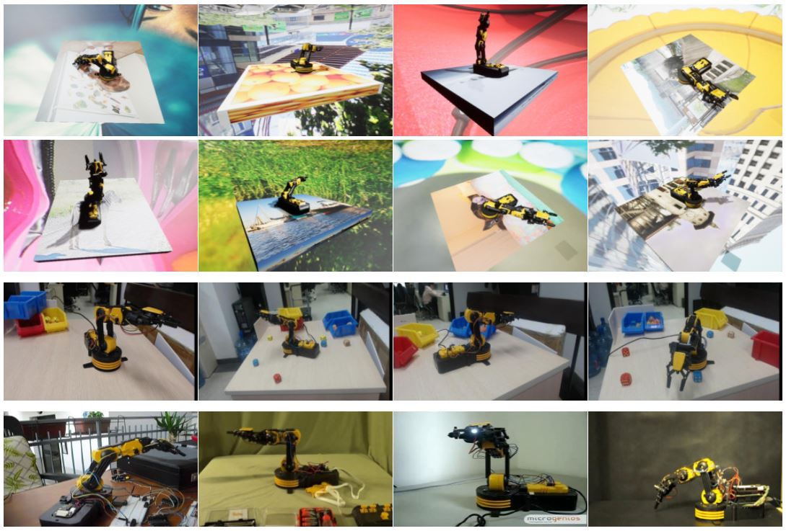
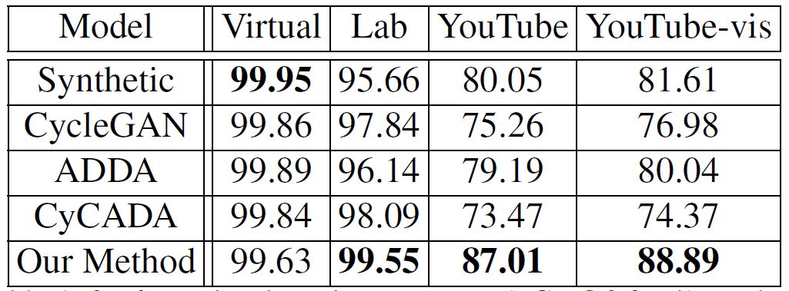
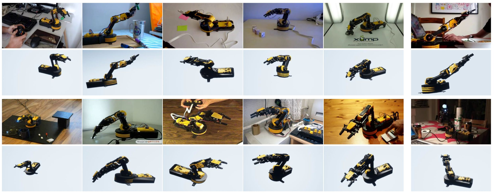

## Overview

We generated **5,000** synthetic images in Unreal Engine 4 with UnrealCV with randomized camera parameters, lighting conditions, arm poses and
background augmentation. Among them, 4,500 are used for training and the remaining 500 for validation. This dataset is referred to as the virtual (synthetic) dataset.

In the real environments, we collected and manually annotated two sets of data. The first one is named the **lab dataset**, which contains more than 20,000 frames captured by a 720P Webcam. We manually chose **428** key frames and annotated them. We deliberately put distractors, e.g. colorful boxes, dices and balls, to make the dataset more difficult.

The second part of real-world image data, the **YouTube dataset**, is crawled from YouTube, which contains 109 videos with the OWI-535 arm. This is a largely diversified collection, in which the arm may even be modded, i.e., the geometric constraints may not hold perfectly. We sampled **275** frames and manually annotated the visibility as well as position for each 2D keypoint. The complete list of youtube videos can be found [here](https://www.youtube.com/playlist?list=PLOnBc7A9ZnwMGnthPtaoB8SR-TTvcfC1P) and can be downloaded with [youtube-dl](https://github.com/youtube-dl/youtube-dl). 

Besides these three datasets, we also released images for finetuning the model in the real domain. These images are captured under the same environment as the lab dataset but from different videos. No annotation for these images and they are used for domain adaptation.

Please refer to our [paper](https://arxiv.org/abs/1812.00725) for technical details.

## Browse
Here are some sample images from the three datasets. From top to bottom: synthetic images (top two rows), lab images and YouTube images.



## Download

Click [here](http://www.cs.jhu.edu/~qiuwch/craves/dataset/) to download these datasets.

Put the zipped file into folder ./data and unzip it. For example, you can put the test dataset into folder `./data/test_20181024.zip` and unzip it.

- 20181107.zip, synthetic training images and ground truth
- ft_20181105.zip, real lab images for fine-tuning with semi-supervised fake labels
- test_20181024.zip, lab test images with 3D ground truth 
- youtube_20181105.zip,YouTube test images with 2D ground truth

If you want to train with the `ft_20181105` dataset, please also download some image you like (e.g. [COCO dataset](http://images.cocodataset.org/zips/val2017.zip)) and put them into the `background_img` folder. These images are for random background replacement. For details, please refer to our paper.

## Data Structure

### The Virtual & Lab Dataset
These two datasets provide 3D annotation. The positions of keypoints in 3D space are saved in json files. We provide python scripts to load the json file and project them into the 2D image coordinate system with respect to the camera parameters.

The folder structure should look like this:
```
./data/20181107
│   readme.txt 
│
└───angles                  // ground-truth motor angles   
│   
└───FusionCameraActor3_2
│   └───caminfo             // ground-truth camera parameters 
│   └───lit                 // RGB images
│   └───seg                 // parsing 
│
└───joint                   // keypoint position in 3D space  
│
......
```

### The YouTube Dataset
The YouTube dataset only provides 2D annotation, as we cannot annotate the accurate 3D pose of the arm without knowing camera parameters. The coordinates of the 2D keypoints are directly saved in json files. 

The folder structure should look like this:
```
./data/youtube_20181105 
│
└───d3_preds                // ground-truth 2D keypoint annotations   
│   
└───imgs                    // RGB images  
│
......
```

## Load the Data
In our repo, we provide a [script](../pose/datasets/arm.py) that loads the raw data and generates groudtruth for training and validation (i.e. heatmaps). 

For the YouTube dataset, it directly load 2D annotation and for the virtual and lab dataset, it first does the function call:
```
joint_2d, vertex_2d, img_path = get_joint_vertex_2d(self.dataset, ids, self.cam_name, self.actor_name)
```
Specifically, it utilizes the dataset class and camera class provided by UnrealCV.

The dataset class loads the camera location and rotation:
```
cams_info = dataset.get_cam_info(cams, ids)
```
and the camera class project the 3D annotation into the image coordinate system and get 2D groundtruth:
```
points2d = cam.project_to_2d(points3d)
```
Finally, the images is resized and cropped and a 17-channel heatmap is generated base on the 2D groundtruth. During the training stage, data augmentation strategies are applied, including random shift, scaling, color shifting and rotation. 

## Evaluation
Running the shell scripts we provide and you will see the accuracy.

For 2D evaluation, we use the metric PCK@0.2, which was purposed by paper[1]. Results are shown below:


For 3D evaluation, we compute the average absolute value of the angular error for the four joints. The average error on lab dataset is 4.8 degrees and some qualitative results are shown below:


For more results, please refer to our [paper](https://arxiv.org/abs/1812.00725).

## References
[1] Yi Yang and Deva Ramanan. Articulated human detection
with flexible mixtures of parts. IEEE transactions on pattern
analysis and machine intelligence, 35(12):2878–2890, 2013.

## Contact
If you have any question or suggestions, please open an issue in this repo. Thanks.
